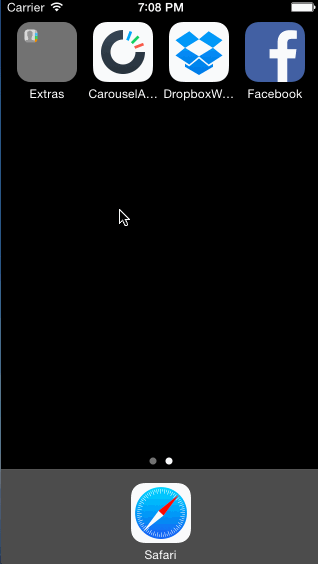

# Carousel Demo

A prototype that follows the user sign in flow, through the welcome screens, and into the app.

Time spent: 11 hours spent in total

Completed user stories:

 * [x] Required: Static photo tiles on the initial screen
 * [x] Required: Sign In
  * Tapping on email/password reveals the keyboard and shifts the scrollview and Sign In button up.
  * User sees an error alert when no email is present or no password is present.
  * User sees a loading screen upon tapping the Sign In button.
  * User sees an error alert when entering the wrong email/password combination.
  * User is taken to the tutorial screens upon entering the correct email/password combination.
 * [x] Required: Tutorial Screens
  * User can page between the screens
 * [x] Required: Image Timeline
  * Display a scrollable view of images.
  * User can tap on the conversations button to see the conversations screen (push).
  * User can tap on the profile image to see the settings view (modal from below).
 * [x] Required: Settings
  * User can dismiss the settings screen.
  * User can log out
 

Walkthrough of all user stories:

GIF created with [LiceCap](http://www.cockos.com/licecap/).

